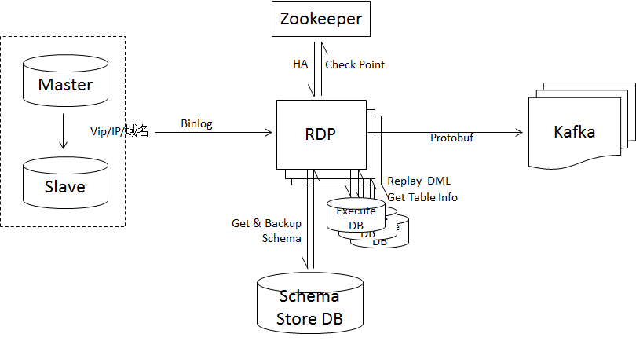

# RDP 部署流程

## 1. RDP Syncer编译部署

下载源码：

```
git clone **********.git ./rdp
cd ./rdp
```

编译源码：

```
make
# 可执行文件包在package目录下
ls package/
rdp_mysql.20180822.tgz  syncer
```

2. RDP部署流程

RDP系统架构图如下：



从架构图可以看出，RDP依赖Zookeeper集群、Kafka集群、Schema Store数据库实例、Execute DB数据库实例。其中Execute DB数据库版本最好与数据源数据库版本一致（因为Execute DB需要回放DDL），与Schema Store数据库版本可以不同。Schema Store与Execute DB公用一个数据库实例。

还需要部署RDP系统架构图中不体现的监控上报模块（InfluxDB+grafana+filebeat）

以下部署流程不包含Zookeeper、Kafka、数据库部（Schema Store/Execute DB）署流程。

以下以ID：10001，源数据库版本：mysql-5.7.22，源数据库IP:127.0.0.1、Port:3306、User:\*\*\*、Passwd:\*\*\*，Schema Store/Execute DB IP:127.0.0.1、Port:10001、User:\*\*\*、Passwd:\*\*\*，Zookeeper集群：192.168.0.1:2181,192.168.0.2:2181,192.168.0.3:2181、Kafka集群：192.168.0.1:9092,192.168.0.2:9092,192.168.0.3:9092和MySQL部署流程这里不做描述，Kafka Topic：topic_10001，Partition:0，MySQL用户\*\*\*所需要的权限在[快速开始](./quickstart.md)中。

下面以上述环境作为例子进行部署说明：

**安装MySQL Client**

```
sudo yum install -y mysql
```

**创建目录**

```
#创建RDP运行目录
mkdir -p /apps/svr/rdp_syncer/base
#创建RDP配置数据目录
mkdir -p /apps/svr/rdp_syncer/data/10001/conf
#创建RDP日志数据目录
mkdir -p /apps/svr/rdp_syncer/data/10001/logs
#创建RDP Binlog Dump数据目录
mkdir -p /apps/svr/rdp_syncer/data/10001/binlogs
#创建RDP监控数据目录
mkdir -p /apps/svr/rdp_syncer/data/10001/metrics
```

**上传文件**

```
上传RDP打包文件rdp_mysql.20180822.tgz至/apps/svr/rdp_syncer/base
```

**RDP Syncer部署**

```
cd /apps/svr/rdp_syncer/base/
mkdir rdp_mysql.20180822 && tar zxvf rdp_mysql.20180822.tgz -C rdp_mysql.20180822
#拷贝配置文件
cp /apps/svr/rdp_syncer/base/rdp_mysql.20180822/syncer.cfg.example /apps/svr/rdp_syncer/data/10001/conf/syncer.cfg
#修改配置文件
vim /apps/svr/rdp_syncer/data/10001/conf/syncer.cfg
```

主要修改配置项：

| 配置项                          | 说明                                               | 值                                                 |
| :------------------------------ | :------------------------------------------------- | -------------------------------------------------- |
| mysql.vip                       | 源数据库IP                                         | 127.0.0.1                                          |
| mysql.port                      | 源数据库端口                                       | 3306                                               |
| mysql.user                      | 源数据库用户名                                     | \*\*\*                                             |
| mysql.password                  | 源数据库密码                                       | \*\*\*                                             |
| mysql.version                   | 源数据库版本                                       | 5.7.22-log                                         |
| group.id                        | RDP集群ID                                          | 10001                                              |
| syncer.host                     | RDP所在机器IP，用于标识RDP进程                     | 192.168.0.4                                        |
| log.dir                         | 日志目录                                           | /apps/svr/rdp_syncer/data/10001/logs               |
| binlog.dir                      | dump binlog目录                                    | /apps/svr/rdp_syncer/data/10001/binlogs            |
| schema.meta.db.host             | schema store ip，可以与execute db相同              | 127.0.0.1                                          |
| schema.meta.db.port             | schema store端口，可以与execute db相同             | 10001                                              |
| schema.meta.db.user             | schema store用户名，可以与execute db相同           | \*\*\*                                             |
| schema.meta.db.password         | schema store密码，可以与execute db相同             | \*\*\*                                             |
| schema.meta.db.database         | schema store database                              | vip_rdp_schema_meta_10001                          |
| schema.executer.db.host         | execute db ip                                      | 127.0.0.1                                          |
| schema.executer.db.port         | execute db端口                                     | 10001                                              |
| schema.executer.db.user         | execute db用户名                                   | \*\*\*                                             |
| schema.executer.db.password     | execute db密码                                     | \*\*\*                                             |
| zk.hosts                        | zookeeper连接地址                                  | 192.168.0.1:2181,192.168.0.2:2181,192.168.0.3:2181 |
| node.list.path                  | zookeeper RDP集群所有本节点目录，单RDP集群独享     | /rdp_syncer/10001/nodes                            |
| leader.path                     | zookeeper RDP集群leader节点目录，单RDP集群独享     | /rdp_syncer/10001/leader                           |
| filter.path                     | zookeeper过滤规则目录，单RDP集群独享               | /rdp_syncer/10001/filter                           |
| checkpoint.path                 | zookeeper checkpoint保存目录，单RDP集群独享        | /rdp_syncer/10001/checkpoint                       |
| kafka.b_version_fback           | kafka版本                                          | 1.0.1                                              |
| kafka.brokerlist                | kafka brokers list                                 | 192.168.0.1:9092,192.168.0.2:9092,192.168.0.3:9092 |
| kafka.topic                     | 写入kafka topic                                    | topic_10001                                        |
| kafka.partition                 | 写入kafka topic partition，只支持写入单个partition | 0                                                  |
| kafka.producer.enable_split_msg | 是否启用分包                                       | 0                                                  |
| compress.enable                 | 是否启用压缩                                       | 0                                                  |
| metrics.file.dir                | metrics 目录                                       | /apps/svr/rdp_syncer/data/10001/metrics            |

**创建Zookeeper目录**

通过Zookeeper Client创建配置文件中node.list.path、leader.path 、filter.path 、checkpoint.path 对应的目录。

```
[zk: localhost:2181(CONNECTED) 1] create /rdp_syncer ''
[zk: localhost:2181(CONNECTED) 1] create /rdp_syncer/10001 ''
[zk: localhost:2181(CONNECTED) 1] create /rdp_syncer/10001/nodes ''
[zk: localhost:2181(CONNECTED) 1] create /rdp_syncer/10001/leader ''
[zk: localhost:2181(CONNECTED) 1] create /rdp_syncer/10001/filter ''
[zk: localhost:2181(CONNECTED) 1] create /rdp_syncer/10001/filter/included ''
[zk: localhost:2181(CONNECTED) 1] create /rdp_syncer/10001/checkpoint ''
```

**初始化Schema Store**

```
cd /apps/svr/rdp_syncer/base/rdp_mysql.20180822/scripts
./init_schema_meta.sh --src-host=127.0.0.1 --src-port=3306 --src-user=rdp --src-passwd=test --dst-host=127.0.0.1  --dst-port=10001 --dst-user=rdp --dst-passwd=test --dst-database=vip_rdp_schema_meta_10001 --reset-dst
#脚本执行结果
{"errno":0,"error":"ok","gtid_binlog_pos":"6098d558-96ec-11e8-a2d7-fa163ef40021:1-41,\nb93fc470-a1fc-11e8-9b46-fa163e8d0f56:1-31156"}
```

**将gtid_binlog_pos写入Zookeeper Checkpoint目录**

```
[zk: localhost:2181(CONNECTED) 1] set /rdp_syncer/10001/checkpoint '{"flag":"1","seq_no":"0","gtid":"6098d558-96ec-11e8-a2d7-fa163ef40021:1-41,b93fc470-a1fc-11e8-9b46-fa163e8d0f56:1-31156"}' -1
```

**启停RDP**

```
cd /apps/svr/rdp_syncer/base/rdp_mysql.20180822/bin
#启动RDP
./start.sh 10001
#将RDP加入到crontab
./install.sh 10001
#停止RDP并删除crontab
./uninstall.sh 10001
```

